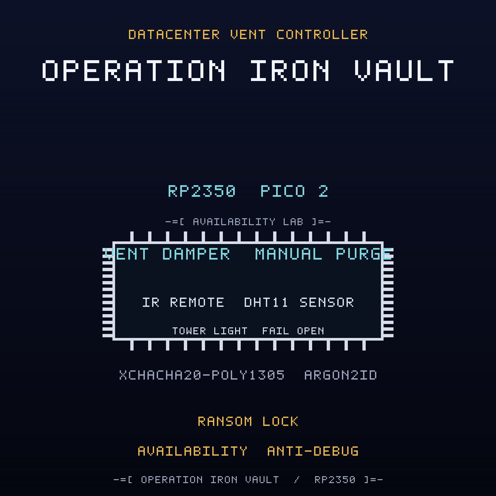

<br>

## FREE Reverse Engineering Self-Study Course [HERE](https://github.com/mytechnotalent/reverse-engineering)
## FREE Embedded Hacking Course [HERE](https://github.com/mytechnotalent/Embedded-Hacking)

<br>

# OPERATION IRON VAULT CTF

### Act VIII - The compromised datacenter vent controller

<br>

***
**LEGAL DISCLAIMER:**
The information, tools, and code provided in this repository and course are strictly for educational, research, and defensive purposes only. 

You are explicitly prohibited from using any materials contained herein to access, test, modify, or exploit any device, network, or system that you do not own 100% or for which you do not have explicit, documented, and legally binding authorization to interact with.

By using this repository and course, you acknowledge and agree that:

1. Any illegal, unauthorized, or malicious use of this information is solely your responsibility.
2. The author(s) and contributor(s) of this repository and course shall not be held liable for any damages, legal repercussions, criminal charges, or unauthorized actions resulting from the use, misuse, or abuse of the contents herein.
3. You will comply with all applicable local, state, national, and international laws regarding cybersecurity and computer fraud.

**IF YOU DO NOT AGREE WITH THESE TERMS, DO NOT USE THIS REPOSITORY AND COURSE.**
***

<br>
<br>

> Hello again, friend.
>
> Act I was the lie. Act II was the door. Act III was the payload. Act IV was the
> payload that would not die. Act V was the payload that spreads. Act VI was the
> payload that steals. Act VII was the payload that takes orders. This is the
> payload that holds the building hostage.
>
> WHITEOUT stopped the task handler and cleared the bot marker, and for a shift
> the floor looked quiet. Quiet is not safe. The Ministry did not need a fleet
> that obeys; it already had a building that cannot breathe. Somewhere between
> the reporting line and the loading dock, the same hand that wrote the leash
> wrote a padlock.
>
> The datacenter vent controller is the device a server hall trusts with its
> air. A damper opens the vent so the racks stay cool. A local maintenance remote
> requests a purge. A rack temperature sensor watches the hall for heat. A vault
> control gateway authorizes an open or a close. That is the whole contract, and
> it is a good one.
>
> FROSTLINE's locker in this one does not spread, and it does not steal, and it
> does not even take orders. It holds the building. It forces the vent closed and
> tells the operator the vent is maintenance locked while the hall heats and the
> racks throttle. It unlocks only on a magic release token, or never, and it
> writes a lock marker into the reserved sector with the real flash API so it
> comes back after a reflash. This is an availability attack wrapped in ransom
> logic: the device withholds the function it exists to provide.
>
> The green lamp still says COOLING OK while the vent is shut. The LCD still
> reports a state, and the state is a lie it was told to repeat. Underneath, the
> building is being held hostage by a padlock with a polite label.
>
> Do not chase the symptoms one at a time. Break the lock. Unmask the display.
> Clear the marker. Then seal the vent command path so no close command can ever
> be forged, and make the vent fail open when the link is lost.
>
> The hall is warming. The readout says maintenance. That is exactly the problem.

This is the companion capture-the-flag to the
[datacenter-vent-controller](https://github.com/mytechnotalent/datacenter-vent-controller)
project. Where the project builds the defended node, this CTF hands you the
**compromised** image that FROSTLINE shipped and asks you to find every defect,
prove it on real hardware, and patch the image.

<br>

## THE MISSION

The `ACT-VIII.bin` image is the OPERATION IRON VAULT datacenter vent controller
with **four deliberate defects**. Each defect is an in-place, same-size byte
patch, so no address moves when you fix it. Every fix is provable on a Pico 2
with a Debug Probe.

| # | Name | What FROSTLINE did |
| - | ---- | ------------------ |
| 1 | The Vent Lock | inverted the lock gate so boot arms the ransom lock, forces the vent closed, and lights the yellow LOCKED lamp |
| 2 | The LCD Mask | inverted the mask gate so the readout renders `ST:MAINT` while the vent is held shut |
| 3 | The Lock Marker | inverted the marker gate so the first boot programs lock marker `0x4C` into reserved sector `0x103FF000` with the real flash API |
| 4 | The Vent Command Authorization | inverted the authorization verdict so an unauthenticated or replayed vent command is accepted |

The wire is sealed with XChaCha20-Poly1305, keyed through Argon2id. The
cryptography is correct. Three of the four defects are not in the cipher at all:
they are a locker that forces the vent closed, masks its own state as routine
maintenance, and writes a durable lock marker to the reserved sector. The fourth
is a policy seam in the vent command path. The locker never needs the cipher. It
sits beside the authenticated link and overrides the output, so a perfectly valid
open command can arrive and the damper will still stay shut. Read the dead, find
the lock, and cut the padlock.

<br>

## THE ARTIFACTS

| File | Role | SHA-256 |
| ---- | ---- | ------- |
| `ACT-VIII.bin` | compromised firmware, the target | `cafc65a395e018e2b4d5eb1cad6a8b69a7f04a33380fa641d40f69f05a31b836` |
| `ACT-VIII.uf2` | flashable image of the target | `753cbfe539d707b7dc30a5345fb43fd4c77739db675e8f4f3c54c55412109df1` |
| `ACT-VIII_fixed.bin` | corrected firmware, the solution | `a4628ceac756e23fb1266133eac69a9fbbdbf4b5634580ba0f62801d1bd7f048` |
| `ACT-VIII_fixed.uf2` | flashable image of the solution | `728b27ad4967c44ac38d17e61e67f4211837554a50d964017a1d335c99733343` |

The two `.bin` files differ in exactly four bytes at offsets
`0xA241, 0xA26B, 0xA283, 0x74C5`, and both are 50,340 bytes. The UF2 images are
101,376 bytes.

<br>

## THE DOCUMENTS

| Document | For |
| -------- | --- |
| [`ACT-VIII-I.md`](ACT-VIII-I.md) | Student instructions: the scenario, the tasks, the wiring |
| [`ACT-VIII-R.md`](ACT-VIII-R.md) | Requirements and grading criteria |
| [`ACT-VIII-S.md`](ACT-VIII-S.md) | Instructor solution key with exact offsets and bytes |
| [`ACT-VIII-main-disasm.txt`](ACT-VIII-main-disasm.txt) | Annotated disassembly of the four sabotage sites |
| [`DESIGN.md`](DESIGN.md) | Build blueprint (instructor eyes only) |

<br>

## HARDWARE

Everything runs on the Embedded Hacking breadboard, and the pin map is identical
to Acts I to VII so one board serves the whole foundation: a Pico 2, a Debug
Probe, a DHT11 rack temperature sensor on GP4, a 1602 I2C LCD vault readout on
GP2/GP3 at address `0x27`, three tower light lamps (red GP16 HALL HOT, yellow
GP17 LOCKED, green GP18 COOLING OK), a manual purge button on GP15, an SG90 vent
damper servo on GP14 with a 1000uF cap, a VS1838B infrared local maintenance
remote on GP5, and an RYLR998 LoRa vault control link on UART1 GP8/GP9. The Debug
Probe is effectively required: the anti-debug trap is part of the exercise. The
pin map is in the instructions.

The cryptographic model is carried over from the earlier acts: Argon2id (`t=3`,
`p=1`, `m=64`) derives the field key, XChaCha20-Poly1305 seals every vent
command, and the anti-replay sequence window and authenticated-state tag are
reused unchanged. The locker is compiled only under `SANDBOX_ONLY`, which the CTF
build defines.

<br>

## QUICK START

Verify the two images against the expected patches and hashes:

```bash
python3 scripts/verify_ctf.py
```

Expected:

```text
10/10 checks passed
```

Build the corrected firmware from source:

```bash
rm -rf build && cmake -S . -B build -G Ninja -DPICO_BOARD=pico2 -DPICO_PLATFORM=rp2350-arm-s -DSANDBOX_ONLY=ON && cmake --build build
```

Run the firmware code standard audit:

```bash
python3 scripts/audit_c_standard.py
```

<br>

## REPOSITORY LAYOUT

```text
ACT-VIII-I.md              student instructions
ACT-VIII-R.md              requirements and grading criteria
ACT-VIII-S.md              instructor solution key
ACT-VIII.bin / .uf2        compromised artifact
ACT-VIII_fixed.bin / .uf2  corrected artifact
ACT-VIII-main-disasm.txt   annotated sabotage sites
scripts/verify_ctf.py      machine verifier
scripts/spoof.py           forged and replayed command injection
src/  include/             firmware sources
CMakeLists.txt             Pico SDK build
DESIGN.md                  build blueprint
```

<br>

## WHERE THIS FITS: OPERATION COLD IRON

This is the companion CTF for **Act VIII (IRON VAULT)** of the ten-act OPERATION
COLD IRON saga. The malware track began in Act III; in Act IV it became
persistence, in Act V it became propagation, in Act VI it became exfiltration, in
Act VII it became command and control, and here it becomes availability and
lockout logic. Act VIII is the act that teaches why a green lamp is not a clean
node, why a device that refuses to do its job is a different failure class, and
why availability is a policy control that no cipher can supply. The project it
attacks is
[datacenter-vent-controller](https://github.com/mytechnotalent/datacenter-vent-controller).

- Previous act: Act VII, IRON CHOIR, the factory floor andon station,
  [factory-andon-station](https://github.com/mytechnotalent/factory-andon-station)
- This act: Act VIII, IRON VAULT, the datacenter vent controller
- Next act: Act IX, IRON FANG, smart-parking-barrier (forthcoming)

<br>

## THE MINISTRY

The Ministry runs the state: the surveillance, the cold chain, the gates, the
pipelines, the air, the cabinets that hold what the state does not discuss, the
lockers that move it, the factories that make it, and the buildings that keep the
record. NorthPharma is one of its deniable industrial fronts, and FROSTLINE is
the contractor that does the work no Ministry letterhead will admit to. FROSTLINE
did not break into this node; it built the locker, taught it to hold the vent
closed, staged the lock marker in a reserved sector, and signed the image.
Against them is WHITEOUT, and the engineer who copied the first image,
NIGHTINGALE. This act is one hall on the Ministry's datacenter floor. TELESCREEN,
the surveillance backbone that watches it, comes after the ten.

- Project repository: [github.com/mytechnotalent/datacenter-vent-controller](https://github.com/mytechnotalent/datacenter-vent-controller)
- This CTF repository: [github.com/mytechnotalent/CTF_datacenter-vent-controller](https://github.com/mytechnotalent/CTF_datacenter-vent-controller)

<br>

# Next
[OPERATION IRON FANG](https://github.com/mytechnotalent/smart-parking-barrier)

<br>

# License
[MIT License](https://github.com/mytechnotalent/CTF_datacenter-vent-controller/blob/main/LICENSE)
